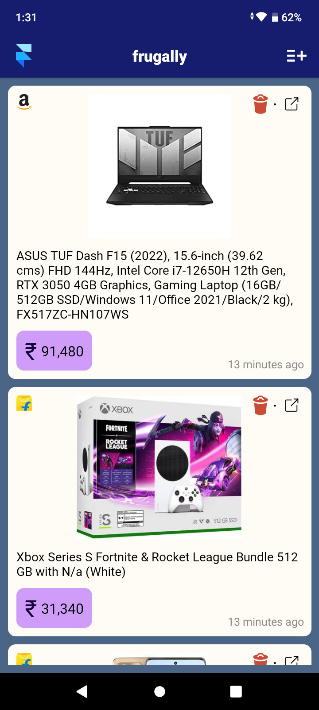
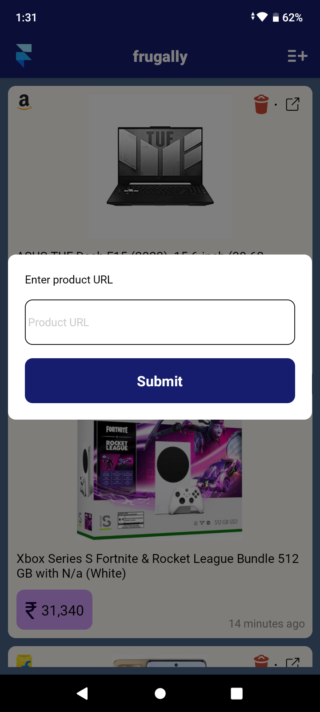
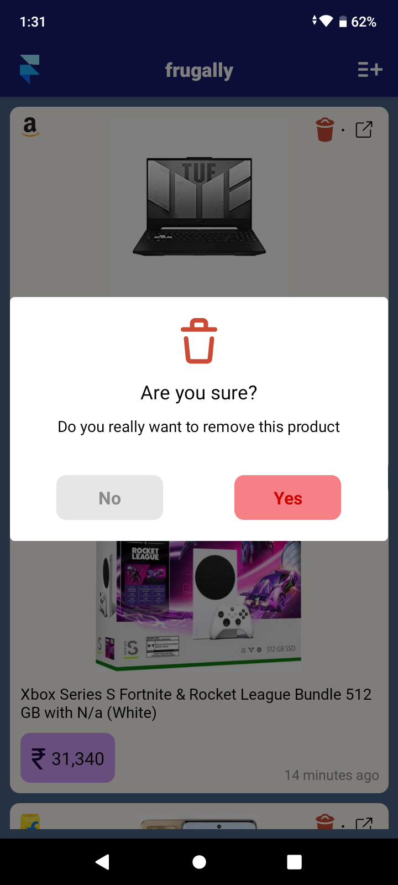

# frugally - Amazon and Flipkart Product Price Tracker

This is my first React Native unofficial project. The motivation for this project is, there are two main ecommerce platform in India [Amazon](https://amazon.in) and [Flipkart](https://www.flipkart.com). I needed to keep track of prices but I don't want to track them individually through each platform wishlist. Ofcource you can use third party service but they show a lot of ads and track user data. I need something that is light weight and donot track user data, no headache of login/singup etc.

## Table of contents

- [Overview](#overview)
  - [The challenge](#the-challenge)
  - [Screenshot](#screenshot)
  - [Links](#links)
- [My process](#my-process)
  - [Built with](#built-with)
  - [What I learned](#what-i-learned)
  - [Continued development](#continued-development)
  - [Useful resources](#useful-resources)
- [Author](#author)

## Overview

### The challenge

Users should be able to:

- [x] User should be able to add product through product link
- [x] Pull down to refetch products
- [x] Last fetched relative. It will update after certain interval
- [x] Deeplinking to open product directly on respective app
- [] Product can also be added directly by sharing
- [] On orientation change update UI
- [] Swipe left/right to remove product
- [] Custom state management

### Screenshot

## My process

### Built with

- React Native
- TypeScript
- Zustand (central state management library)

### What I learned

I sharping my skill on React Native and typescript. I've tried to Atomic structure. At later point I'll try to replace zustand with my custom solution. However I'll do it at the very end after all the project milestones is completed.

### Continued development

I'll continue learn and sharpen my skill on React Native and TypeScript.

### Useful resources

- [React native](https://reactnative.dev/) - Official React Native documentation
- [TypeScript](https://www.typescriptlang.org/) - Official TypeScript documentation
- [Zustand](https://www.npmjs.com/package/zustand) - Zustand library

## Author

- Website - [Atir Nayab](https://github.com/nayabatir1)
- Twitter - [@nayabatir1](https://twitter.com/nayabatir1)
- <a href="mailto:nayabatir1@gmail.com">contact me</a>
